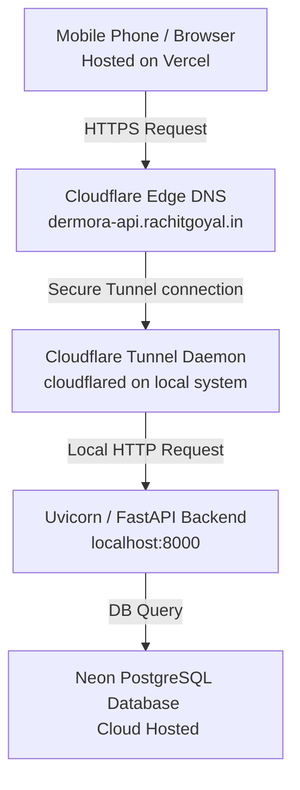

# Dermora.ai: Backend & Cloudflare Tunneling Architecture

This document explains the network architecture of the Dermora project, detailing how requests flow from a Vercel-deployed frontend (on a mobile phone or laptop) to a local backend server running on your machine via a secure Cloudflare Tunnel.

---

## 1. Architectural Overview

Instead of opening router ports (traditional port forwarding) or exposing your local IP address to the public internet, this setup utilizes a **Cloudflare Tunnel** (`cloudflared`).



---

## 2. Step-by-Step Request Lifecycle

When you attempt to log in, sign up, or upload an image on your mobile phone:

1. **User Action**: The frontend application running on your mobile phone (hosted at Vercel) makes an API call to `https://dermora-api.rachitgoyal.in/auth/login`.
2. **DNS Resolution**: The domain `dermora-api.rachitgoyal.in` points to Cloudflare's global edge network.
3. **Cloudflare Edge**: Cloudflare intercepts the request, handles the SSL/TLS handshake (providing HTTPS by default), and routes the request down the persistent outbound TCP connection established by your local `cloudflared` client.
4. **Local Tunnel Agent (`cloudflared`)**: The `cloudflared` daemon running on your computer receives the request from Cloudflare's network.
5. **Local Port Forwarding**: The tunnel daemon forwards the incoming HTTP traffic locally to your Uvicorn server:
   - Configured Target: `http://localhost:8000` (as defined in `tunnel-id.md`).
6. **FastAPI & CORS Processing**:
   - The FastAPI backend receives the request.
   - The CORS middleware checks the `Origin` header (e.g., `https://your-frontend.vercel.app`). 
   - Because we configured `allow_origin_regex=r"https?://.*"`, the backend attaches the header `Access-Control-Allow-Origin: https://your-frontend.vercel.app` to the response.
7. **Database Interaction**: The backend processes the auth credentials, hashes/verifies passwords, queries the Neon cloud database, and compiles the response.
8. **Response Return Path**: The response travels back in reverse order:
   `FastAPI` ➔ `cloudflared` ➔ `Cloudflare Edge` ➔ `Mobile Browser`.

---

## 3. Why Cloudflare Tunneling is Better than Traditional Port Forwarding

| Feature | Cloudflare Tunneling (`cloudflared`) | Traditional Router Port Forwarding |
| :--- | :--- | :--- |
| **Security** | **High**: No open inbound ports on your home router. Prevents DDOS and port scanning. | **Low**: Exposes your home router port to the open internet, leaving it vulnerable to attacks. |
| **IP Exposure** | **Hidden**: Your home/office public IP address is never revealed. | **Exposed**: Your raw public IP address is public. |
| **SSL/TLS** | **Automatic**: Cloudflare manages the SSL certificate (`HTTPS`). | **Manual**: You must configure SSL (e.g. Let's Encrypt) on your local machine. |
| **ISP Restrictions** | **Bypassed**: Works even if your ISP uses CGNAT (Carrier-Grade NAT) or blocks inbound ports. | **Blocked**: Often blocked by ISPs or home network configurations. |

---

## 4. Key Configurations in the Codebase

### A. Tunnel Definition (`docs/tunnel-id.md`)
The ingress rules define how incoming public hostnames map to local services:
```yaml
ingress:
  - hostname: dermora-api.rachitgoyal.in
    service: http://localhost:8000
  - service: http_status:404
```

### B. Frontend Endpoint (`frontend/.env`)
The frontend points to the public tunnel hostname:
```env
VITE_BACKEND_URL=https://dermora-api.rachitgoyal.in
```

### C. CORS Configuration (`backend/app/main.py`)
To prevent the browser from blocking requests originating from Vercel:
```python
app.add_middleware(
    CORSMiddleware,
    allow_origin_regex=r"https?://.*", # Dynamically allows all Vercel and local subdomains
    allow_credentials=True,
    allow_methods=["*"],
    allow_headers=["*"],
)
```
